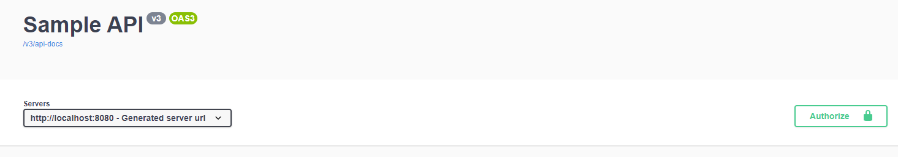
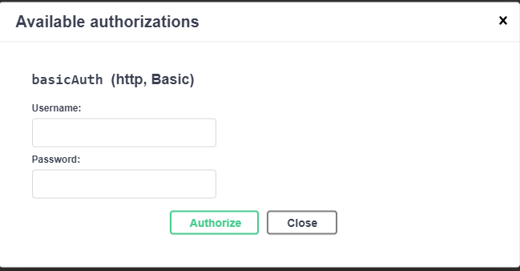
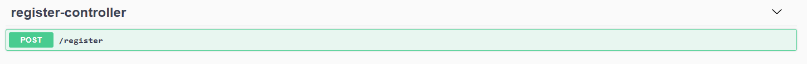
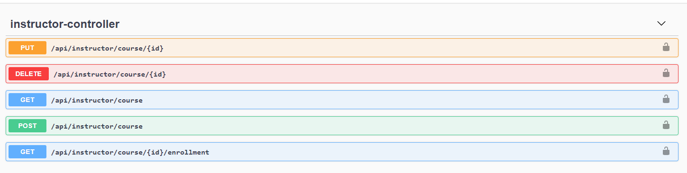
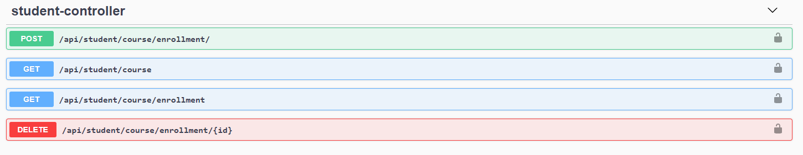

## ACME-Learning Application

This Repository contains the code for the project "ACME Learning"


### Following is the list of requirements to run the application

### Java 11

* Any version of jdk11+ is required for compiling and running the project


### Environment variables

* APP_FOOD_BOWL_DATABASE_URL can be used to configure database file URL, but using local directory is recommended, following the example URL -> jdbc:h2:file:./db/acme
* SPRING_DATASOURCE_USERNAME should be used to configure the username of the database, or you can modify the property directly in the properties file
* SPRING_DATASOURCE_PASSWORD should be used to configure the password for the user configured for the database, or you can modify the property directly in the properties file
* SERVER_PORT only if you want to run the app in a different port, by default it runs on 8080
* IMPORTANT there is no file added by default for the DB, it will be created at the moment of running the application


<br/>

## Usage

### Running the application

You can git the repository with git clone

`git clone https://github.com/kanavi2099/acme-learning.git`

once downloaded you can use line command script for building the project, as a requirement you must have set the ENV JAVA_HOME in the system with a Java 11+ version home folder 

In Linux systems you can use

```Bash
./mvnw clean
./mvnw install
```

for windows use 
```Bash
mvnw.cmd clean
mvnw.cmd install
```


or if you prefer you can use your own Maven distribution installed on your system in the root folder of the project
```Bash
mvn clean
mvn install
```


this will create a `target` folder with the jar inside, you can run the app by command line

```Bash
java -jar acme-learning-0.0.1-SNAPSHOT.jar
```

### Swagger-ui

You can use the swagger-ui interface located in http://localhost:8080/swagger-ui/index.html once the server is running

Using the interface you can create users to access the different methods exposed, use `Register controller` and choose a
name, username and password for using the app

Take into consideration that the json required for creating the user is the following

{"name": "string","username": "string","password": "string","type": "INSTRUCTOR"}

where the parameter "type" can be of 2 possible values
* INSTRUCTOR
* STUDENT

Methods from `instructor-controller` can only be used by users of type "INSTRUCTOR" and `student-controller` by "STUDENT" types

Before sending a request out of `register-controller` you need to log the created users with the `authorize`




### Web Request

If you want to use an application to manually make requests to the app, like postman, you need to add the authorization
headers for the methods in `instructor-controller` and `student-controller` , but they won't be required for creating users


## Web Resources Available

Following are the available resource paths available included in the app

### /register

* POST method will allow to create a user, be it a INSTRUCTOR or a STUDENT



### /api/instructor/course

* GET method will return a list of courses created by the authorized instructor
* POST method will create a course for the authorized instructor

### /api/instructor/course/{id}

* PUT method will update the course with the given id and will set it as a "started state", indicated by the flag "inCourse"
* DELETE method will cancel the course with the given id as long as it has not started

### /api/instructor/course/{id}/enrollment

* GET method will return a list of "STUDENT" that are enrolled in the course with the given id



### /api/student/course

* GET method will return a list of courses for students to enroll

### /api/student/course/enrollment/

* GET method will return a list of courses that the student has enrolled in
* POST method will allow the student to enroll into a course

### /api/student/course/enrollment/{id}

* DELETE method will allow the student to drop from the course 


